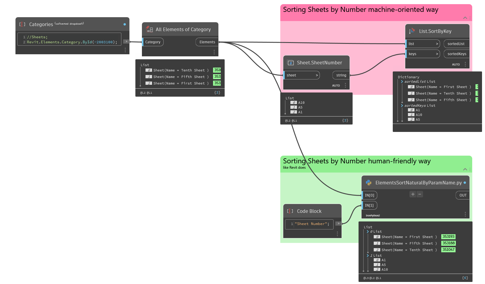

# Elements Sort Naturally By Parameter Name

__Description__

Sort Elements naturally by Parameter Value using `Autodesk.Revit.DB.NamingUtils.CompareNames` comparer.

If Element does not have a valid Parameter or its Value is None, it is ignored from sorting.

