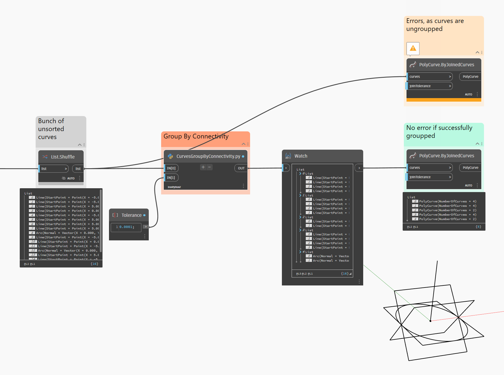

# Group Curves by connectivity.

Useful for grouping unordered curves before supplying to PolyCurve.ByJoinedCurves node.
___
- Supply: list of curves.
- Returns: list of curves, grouped by connectivity (have common point).
___
- Script does not check for duplicated curves or possible branches (when more than two curves share one point). Do it yourself before or after grouping!
- Script does not flip or sort the curves for chaining (PolyCurve.ByJoinedCurves does it itself).
___
Tested with Dynamo 2.13
