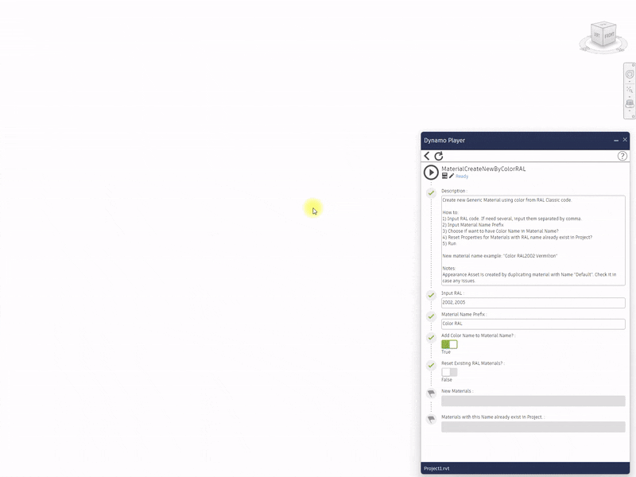

# Create new Generic Material using color from RAL Classic code. 

__How to:__

    1) Input RAL code. If need several, input them separated by comma.
    2) Input material name prefix.
    3) Choose if want to have color name in material name.
    4) Reset Properties for Materials with RAL name which already exist in project?
    5) Run

New material name example: "Color RAL2002 Vermilion"

***Notes:***
_Appearance asset is created by duplicating material with name "Default". Check it in case any issues._

___

