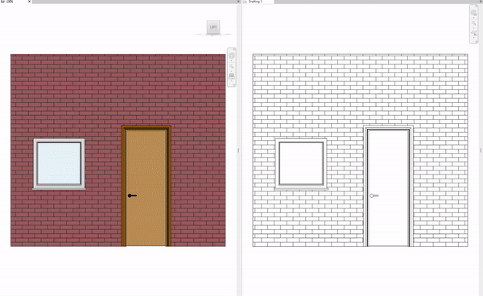

# Redraw Drafting View by the given View.

__How to:__

    1) Select Source View (any graphic view);
    2) Select Destination View (Drafting Only). All content of this view will be redrawn;
    3) Pick Fill Region by item from list (first item by default);
    4) Pick Pick Line style by item from list (first item by default).

Tested with Dynamo 2.12

