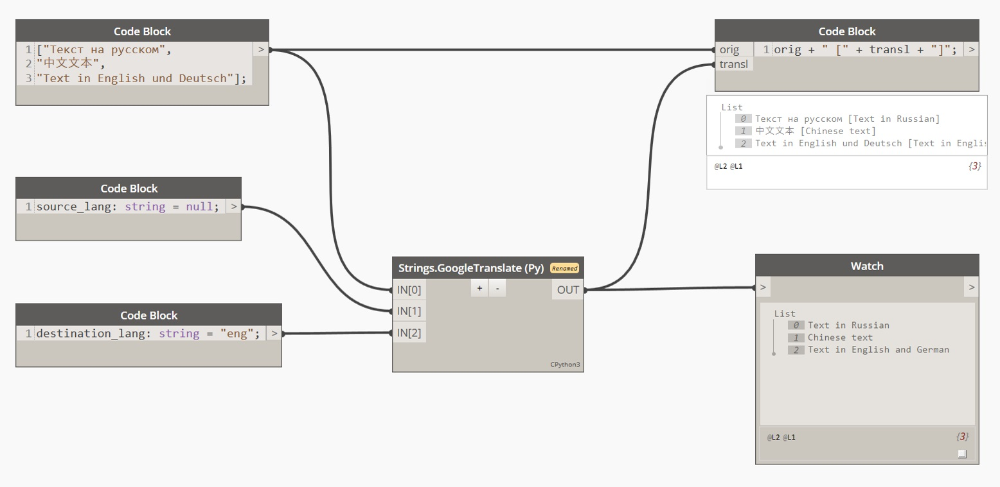
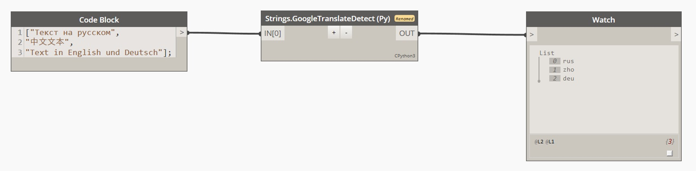

# Work with strings using Google Translate service

## IMPORTANT:

- Scripts are for CPython3 only ([Introduced in Dynamo 2.7](https://dynamobim.org/dynamo-core-2-7-release/)). Not intended to work with IronPython.
- Tested with Dynamo 2.12
- Scripts use module [translatepy](https://github.com/Animenosekai/translate) which has to be installed.
- More about installing Python modules in Dynamo:\
    https://github.com/DynamoDS/Dynamo/wiki/Customizing-Dynamo%27s-Python-3-installation \
    https://forum.dynamobim.com/t/how-to-install-python-modules-in-dynamo-core-runtime-2-8-0/52922/32

___

### Content
 1. [StringsGoogleTranslate.py](Dynamo/Scripts/GoogleTranslate/python/StringsGoogleTranslate.py)
    Translates list of strings using Google Translate service.
 3. [StringsGoogleTranslateDetect.py](Dynamo/Scripts/GoogleTranslate/python/StringsGoogleTranslateDetect.py)
    Takes list of strings and detects the language of each string using Google Translate service.

___
### 1. StringsGoogleTranslate

[StringsGoogleTranslate.py](Dynamo/Scripts/GoogleTranslate/python/StringsGoogleTranslate.py)

**Translates list of strings using Google Translate service.**

- It is better to define source/destination language by its three-letter code according to ISO 639-2 / ISO 639-3:\
    https://en.wikipedia.org/wiki/List_of_ISO_639-2_codes \
    Simple language names are also acceptable ("English", "Japanese", etc).

- If source language was not provided, service will try to define it automatically.
    This way works better with strings of mixed languages.

- By default translation is done via `translate.google.com` server. Feel free to change it to other suitable server in your region using SERVER_URL constant.\
    Example: `SERVER_URL = 'translate.google.cn'`

- List of supported languages and servers can be found here:\
    https://github.com/Animenosekai/translate/blob/main/translatepy/translators/google.py

- By default translatepy [caches](https://github.com/Animenosekai/translate#caching) translation results for better performance.
    Current script cleans the caсhe in the end of translation:
    controlled via `CLEAN_TRANSLATION_CASHE` constant.\
    You may want to disable the cleaning.

- As it is mentioned in translatepy [disclaimer](https://github.com/Animenosekai/translate#disclaimer):\
    Please do not use this module in a commercial manner.
    Pay a proper API Key from one of the services to do so.
___

### 2. StringsGoogleTranslateDetect

[StringsGoogleTranslateDetect.py](Dynamo/Scripts/GoogleTranslate/python/StringsGoogleTranslateDetect.py)

**Takes list of strings and detects the language of each string using Google Translate service.**

- Detected language result is a string with three-letter code according to ISO 639-2 / ISO 639-3:\
    https://en.wikipedia.org/wiki/List_of_ISO_639-2_codes

- By default translation is done via `translate.google.com` server. Feel free to change it to other suitable server in your region using SERVER_URL constant.\
    Example: `SERVER_URL = 'translate.google.cn'`

- List of supported languages and servers can be found here:
    https://github.com/Animenosekai/translate/blob/main/translatepy/translators/google.py

- By default translatepy [caches](https://github.com/Animenosekai/translate#caching) translation results for better performance.
    Current script cleans the caсhe in the end of translation:
    controlled via `CLEAN_TRANSLATION_CASHE` constant.\
    You may want to disable the cleaning.

- As it is mentioned in translatepy [disclaimer](https://github.com/Animenosekai/translate#disclaimer):\
    Please do not use this module in a commercial manner.
    Pay a proper API Key from one of the services to do so.
